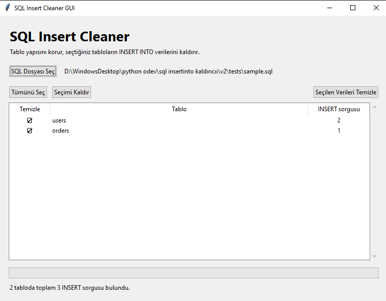

# SQL Insert Cleaner GUI

SQL dump dosyalarındaki `INSERT INTO` sorgularını, tablo yapısını ve orijinal dosyayı koruyarak temizleyen masaüstü uygulaması.
## Screenshot


## Özellikler

- SQL dosyasındaki veri içeren tabloları otomatik listeler.
- Temizlenecek tabloları tek tek seçtirir.
- Çok satırlı `INSERT INTO` sorgularını algılar.
- Metin değerlerinin içindeki noktalı virgülleri sorgu sonu kabul etmez.
- `CREATE TABLE`, yorumlar ve seçilmeyen tabloları korur.
- Orijinal SQL dosyasının üzerine yazılmasını engeller.
- Büyük dosyalarda işlemi arka planda çalıştırarak arayüzün donmasını önler.
- Temizlenen sorgu sayılarını tablo bazında raporlar.

## Gereksinimler

- Python 3.8 veya üzeri
- Tkinter

Windows Python kurulumlarında Tkinter genellikle hazır gelir. Uygulamayı çalıştırmak için harici paket gerekmez.

## Çalıştırma

Projeyi indirin ve klasörde bir terminal açın:

```bash
python main.py
```

Windows kullanıcıları ayrıca `start.bat` dosyasına çift tıklayabilir.

Ardından:

1. `SQL Dosyası Seç` düğmesine basın.
2. Verileri temizlenecek tabloları işaretleyin.
3. `Seçilen Verileri Temizle` düğmesine basın.
4. Yeni SQL dosyasının adını ve konumunu seçin.

Uygulama, kaynak dosyanın üzerine yazılmasına izin vermez.

## Testler

Testleri çalıştırın:

```bash
python -m unittest discover -s tests -v
```

## Proje yapısı

```text
sql-insert-cleaner/
├── main.py
├── cleaner.py
├── start.bat
├── tests/
│   ├── sample.sql
│   └── test_cleaner.py
├── .github/workflows/tests.yml
├── .gitignore
├── LICENSE
└── README.md
```
## Download

Windows kullanıcıları, Python kurmadan uygulamanın hazır EXE sürümünü indirebilir:

[Download SQL Insert Cleaner for Windows](https://github.com/g0khanbey/sql-insert-cleaner/releases/latest)

Release sayfasındaki **Assets** bölümünden `SQL-Insert-Cleaner.exe` dosyasını indirip çalıştırın.

## Güvenlik yaklaşımı

- Kaynak dosya salt okunur açılır.
- Çıktı önce geçici dosyaya yazılır, işlem başarılıysa hedef dosyaya taşınır.
- Kaynak ve hedef yolu aynıysa işlem durdurulur.
- SQL dosyası herhangi bir sunucuya gönderilmez; işlem yerel bilgisayarda yapılır.

Yine de önemli SQL dosyaları üzerinde işlem yapmadan önce yedek alınması önerilir.

## Bilinen sınırlar

- Özel `DELIMITER` kullanan stored procedure ve trigger dump dosyaları tam desteklenmez.
- Uygulama yalnızca `INSERT INTO` sorgularını temizler; `COPY`, `REPLACE INTO` ve benzeri veri ekleme biçimleri kapsam dışındadır.

## Lisans

Bu proje MIT Lisansı ile yayımlanmıştır.
